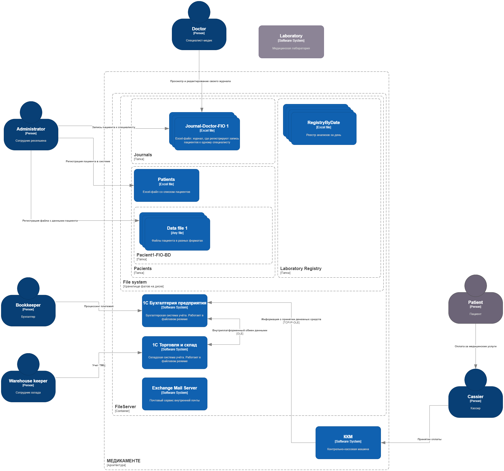
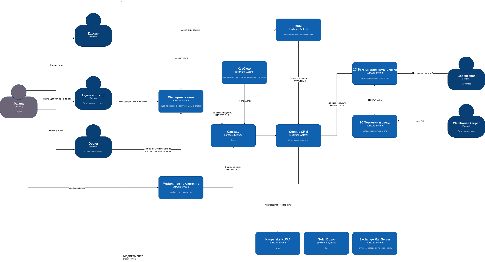

# Проектная работа 10 спринта

Landscape системы (as-is)

## Задание 1. Анализ безопасности системы

["./Task1/ReadMe.md"](./Task1/ReadMe.md)

## Задание 2. Проектирование решения

["./Task2/c4_context_diagram.drawio"](./Task2/c4_context_diagram.drawio)

## Задание 3. Оценка Data Encryption at Rest and In Transit

["./Task3/ReadMe.md"](./Task3/ReadMe.md)