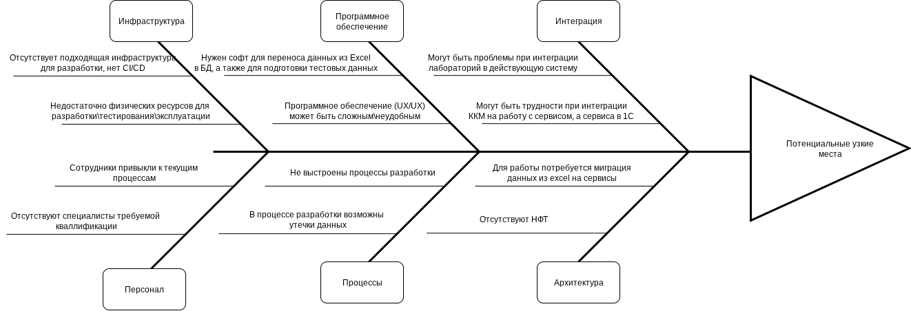

# Задание 4. Оценка узких мест при миграции

## Список мер по устранению выявленных узких мест на основе диаграммы

### Инфраструктура

**1. Отсутствует подходящая инфраструктура для разработки, нет CI/CD**

Решение: Подготовить описание инфраструктуры и требования, какие сервера должны быть, что и где разворачивается, где хранятся исходные тексты, нужен ли Jenkins или будем использовать Gitlab CI. Все это требуется до начала разработки, иначе есть риск возникновения простоя дорогих специалистов.

**2. Недостаточно физических ресурсов для разработки\тестирования\эксплуатации**

Решение: Требуется рассчитать необходимые ресурсыс и стоимость, а также принять решение, будет ли осуществляться разработка на своих мощностях, либо в облаке. Как и в предыдущем пункте, рассчеты и закупка требуедтся до начала разработки.

### Персонал

**1. Сотрудники привыкли к текущим процессам**

Решение: Требуется провести обучение, бюджет на это нужно заложить в самом начале разработки, в противном случае ожидается снижение производительности труда.

**2. Отсутствуют специалисты требуемой кваллификации**

Решение: Для разработки собственного, надежного решения, потребуются специалисты самых разных специализаций, на пример: Frontend Developer, Backend Developer, РП, UI/UX дизайнер, QA, ИБ, DevOps, Аналитик, TeamLead, Архитектор.

### Программное обеспечение

**1. Нужен софт для переноса данных из Excel в БД, а также для подготовки тестовых данных**

Решение: Для разработки и тестирования не нужны реальные данные, и все же, они должны быть к ним очень близки, требуется разработать инструмент, например для конвертации Excel в CSV, маскирования чувствительных данных, далее можно выгрузить в Postgres при помощи команды COPY как пример. Возможно потребуется поменять структуру, это можно сделать руками заранее в excel, либо разработать инструмент для конвертации в CSV на Python. При этом, для Prod. среды, данные потребуются без маскирования.

**2. Программное обеспечение (UX/UX) может быть сложным\неудобным**

Решение: Требуется UI/UX дизайнер интерфейсов.

### Процессы

**1. Не выстроены процессы разработки**

Решение: В контексте разработки - требуется Team Lead разработки, который совместно с РП сможет построить эффективный процесс, желательно до начала самой разработки. 

**2. В процессе разработки возможны утечки данных**

Решение: Важно ограничить доступ к исходным данным, требуется специалист ИБ, важно заключить НДА с разработчиками. Данные в чистом виде не должны попасть кому либо за пределами допустимых ролей. Определить роли.

### Интеграция

**1. Могут быть проблемы при интеграции лабораторий в действующую систему**

Решение: Требуется определить  до  начала разработки, как данные по анализам попадают в Excel, если у лаборатории имеется свое API, реализовать интеграцию. Если данные передаются ввиде скана, то требуется UI для внесения данных в систему, и защищенное хранилище изображений.

**2. Могут быть трудности при интеграции ККМ на работу с сервисом, а сервиса в 1С**

### Архитектура

**1. Для работы потребуется миграция данных из excel на сервисы**

**2. Отсутствуют НФТ**